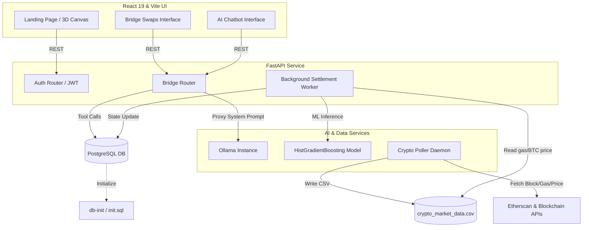

# ⚡ Bridgr

> **AI-Driven L2 Cross-Chain Atomic Swap Portal with Machine Learning Liquidity Settlement Optimizer**

Bridgr is a next-generation Layer 2 cross-chain swap protocol simulator and portal. It streamlines cross-chain atomic asset transfers (supporting USDT, USDC, ETH, and SOL) while employing an autonomous **Machine Learning Engine** to determine optimal, gas-efficient liquidity pool settlements based on real-time and historical network indicators. Additionally, Bridgr integrates a local LLM-powered **AI Copilot** (via Ollama) equipped with tool-calling capabilities to allow users to inspect their wallet balances and transaction histories through natural conversation.

---

## 🗺️ System Architecture

Bridgr operates as a three-tier system: a React 3D frontend, a FastAPI & PostgreSQL backend, and an ML-driven settlement engine.



---

## 📂 Repository Structure

```directory
Bridgr/
├── backend/                       # FastAPI Python application
│   ├── app/
│   │   ├── routers/               # Router endpoints (auth, bridge/chat)
│   │   │   ├── auth.py
│   │   │   └── bridge.py
│   │   ├── database.py            # SQLAlchemy engine setup
│   │   ├── models.py              # DB schema (User, Balance, SystemPool, Transaction)
│   │   ├── schemas.py             # Pydantic schemas
│   │   └── settlement_worker.py   # Async 5-minute ML settlement task
│   ├── alembic/                   # Database migrations
│   ├── Dockerfile                 # Backend container definition
│   └── requirements.txt           # Python dependency checklist
├── frontend/                      # React frontend built with Vite
│   ├── src/
│   │   ├── components/            # UI components (Navbar, Footer, ThreeBackground)
│   │   ├── pages/                 # Pages (Landing, Login, Bridge, Chat)
│   │   ├── App.jsx                # Router & App Shell
│   │   └── index.css              # Custom styling / Dark theme / CSS Variables
│   ├── Dockerfile                 # Frontend container definition
│   └── package.json               # Node dependency configurations
├── AI ENGINE/                     # Machine learning system
│   ├── data/                      # Historical feature dataset (5min_features.csv)
│   ├── model/                     # Trained HistGradientBoosting model (settlement_model.joblib)
│   ├── data_aggregator.py         # Features engineering script (L1 metrics aggregation)
│   └── settlement_system.py       # ML Pipeline training and simulation
├── db-init/                       # DB Initialization
│   └── init.sql                   # SQL script to populate tables & schemas
├── docker-compose.yml             # System orchestration setup
├── crypto_poller.py               # CLI daemon to fetch ETH/BTC prices & gas fees
├── settlement_scheduler.py        # Standalone CLI scheduler for ML pool evaluation
└── .env                           # Local environment configuration file
```

---

## ⚙️ Environment Configuration

Create a `.env` file in the root directory to store configuration parameters:

| Variable | Type | Default Value | Description |
| :--- | :--- | :--- | :--- |
| `ETHERSCAN_API_KEY` | String | *Optional* | API Key to fetch live gas details and block height. |
| `DATABASE_URL` | String | `postgresql://postgres:postgres@db:5432/payment_portal` | DB Connection URI. For local runs outside Docker, use host mapping. |
| `OLLAMA_BASE_URL` | String | `http://127.0.0.1:11434` | Endpoint for the local Ollama chatbot engine. |
| `SETTLEMENT_HARD_LIMIT_USDT` | Float | `5000.0` | Settle pool instantly if absolute exposure exceeds this value. |
| `SETTLEMENT_HARD_LIMIT_USDC` | Float | `5000.0` | Settle pool instantly if absolute exposure exceeds this value. |
| `SETTLEMENT_HARD_LIMIT_ETH` | Float | `1.5` | Settle pool instantly if absolute exposure exceeds this value. |
| `SETTLEMENT_HARD_LIMIT_SOL` | Float | `35.0` | Settle pool instantly if absolute exposure exceeds this value. |

---

## 🚀 Quickstart Guide

### Option A: Run via Docker Compose (Recommended)

To orchestrate the complete network (FastAPI backend + React frontend + PostgreSQL database + automatic DB initialization) in containers:

1. Build and run the docker containers:
   ```bash
   docker-compose up --build
   ```
2. The application will expose:
   - **Frontend UI**: [http://localhost:5174](http://localhost:5174)
   - **FastAPI API Documentation**: [http://localhost:8001/docs](http://localhost:8001/docs)
   - **PostgreSQL Database**: Port `5433` (mapped from container `5432`)

> [!NOTE]
> The database container automatically maps schema creation and updates via `./db-init/init.sql` on startup.

---

### Option B: Run Locally (Bare-Metal)

#### 1. Setup the Database
- Spawn a PostgreSQL server on port `5433` or configure your local database.
- Create a database named `payment_portal`.
- Run the schema from [db-init/init.sql](file:///home/bifrost/Projects/Bridgr/db-init/init.sql) to initialize structures.

#### 2. Run the Backend
- Navigate to the `backend/` folder and setup a virtual environment:
  ```bash
  cd backend
  python3 -m venv .venv
  source .venv/bin/activate
  pip install -r requirements.txt
  ```
- Run migrations and start the dev server:
  ```bash
  uvicorn app.main:app --host 127.0.0.1 --port 8001 --reload
  ```

#### 3. Run the Frontend
- Navigate to the `frontend/` folder:
  ```bash
  cd frontend
  npm install
  npm run dev
  ```
- Open [http://localhost:5173](http://localhost:5173) in your browser.

---

## 🧠 Machine Learning Settlement Engine

A crucial challenge of Layer 2 bridges is **rebalancing/settlement cost vs. liquidity risk**. Settle too frequently, and gas costs consume profit margins. Settle too slowly, and the pool becomes unbalanced (exposing the system to insolvency risk).

Bridgr solves this using a **two-tiered decision pipeline**:

### 1. Hard Limits (Rule-Based Fallback)
If the absolute pool exposure ($|Exposure|$) exceeds the env-defined limit (e.g. `SETTLEMENT_HARD_LIMIT_USDT`), a forced settlement is executed immediately.

### 2. Machine Learning Inference (Classification)
If exposure is below the limit, the system invokes a pre-trained **HistGradientBoostingClassifier** (`sklearn`). Every 5 minutes, the engine evaluates:
- **L2 Metrics**: Transaction frequency, volume, ERC-20 ratio, unique senders/receivers in the last 300 seconds.
- **L1 Network Costs**: Live gas prices (Safe, Propose, Fast, suggestBaseFee).
- **Price Indicators**: Token price ranges, volatility, buy/sell taker ratios (via Binance).
- **Liquidity Health**: Current pool liquidity ratios.

The classifier predicts whether to `SETTLE (1)` or `WAIT (0)`. If a settlement is triggered, it adjusts the pool's exposure back to `0.0`.

#### Running the ML Pipeline Scripts
You can inspect or retrain the system using scripts in `AI ENGINE`:
- **Retrain the model**: `python3 settlement_system.py` inside `AI ENGINE/` (produces `settlement_model.joblib`, `balance_over_time.png`, and `cumulative_cost.png`).
- **Log blockchain metrics to CSV**: Run the daemon in the background to log Etherscan/Blockchain data:
  ```bash
  python3 crypto_poller.py
  ```
- **Run independent CLI scheduler**:
  ```bash
  python3 settlement_scheduler.py
  ```

---

## 💬 AI Chatbot Copilot & Tool Calling

Bridgr integrates an interactive chat assistant (using a local **Ollama** server) that uses **Tool Call Interception** to act as a financial assistant.

```
User: "What is my current balance?"
  │
  ▼
FastAPI Backend (injects user context & system prompt)
  │
  ▼
Ollama Response: "CALL_TOOL: get_user_balances"
  │
  ▼
FastAPI Intercepts string ──> Queries DB (Balance table)
  │
  ▼
FastAPI Appends tool result ──> Re-calls Ollama
  │
  ▼
Ollama Answer: "You have 10,000.00 USDT and 1.5 ETH."
```

### Supported AI Agent Commands:
- **`get_user_balances`**: Triggered when users inquire about funds, asset holdings, or wallet balances.
- **`get_transaction_history`**: Triggered when users ask for recent transfers or past transaction history.

To enable this feature, make sure an Ollama server is running locally (e.g. `ollama run llama3:latest`) and is accessible by the backend server.
